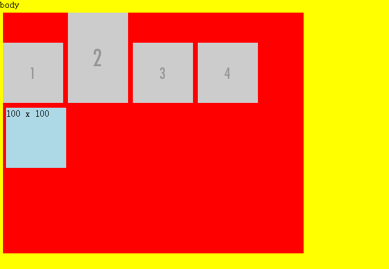

**1.介绍bootstrap与jQuery框架**

Bootstrap是Twitter于2011年8月在Github上发布的的开源产品，是目前最受欢迎的HTML、CSS和JS框架，用于开发响应式布局、移动设备优先的WEB项目。
将常见的CSS布局组件和JavaScript插件进行了整合并完善的封装，能让没有经验的前端工程师后后端工程师都迅速掌握和使用，大大提高开发效率。
某种程度上，还能规范前端团队编写CSS和JavaScript

jQuery 是一个高效、精简并且功能丰富的 JavaScript 工具库。它提供的 API 易于使用且兼容众多浏览器，这让诸如 HTML 文档遍历和操作、事件处理、动画和 Ajax 操作更加简单。

**2.前端页面性能优化的方法**

前端优化的目的是什么 ?  
1. 从用户角度而言，优化能够让页面加载得更快、对用户的操作响应得更及时，能够给用户提供更为友好的体验。  
2. 从服务商角度而言，优化能够减少页面请求数、或者减小请求所占带宽，能够节省可观的资源。  

前端优化的途径有很多，按粒度大致可以分为两类，第一类是页面级别的优化，例如 HTTP请求数、脚本的无阻塞加载、内联脚本的位置优化等 ;第二类则是代码级别的优化，例如 Javascript中的DOM 操作优化、CSS选择符优化、图片优化以及 HTML结构优化等等。另外，本着提高投入产出比的目的，后文提到的各种优化策略大致按照投入产出比从大到小的顺序排列。

一、页面级优化  
1. 减少 HTTP请求数  
(1). 从设计实现层面简化页面
(2). 合理设置 HTTP缓存
(3). 资源合并与压缩
(4). CSS Sprites
(5). Inline Images
(6). Lazy Load Images  
2. 将外部脚本置底  
3. 异步执行 inline脚本  
4. Lazy Load Javascript  
5. 将 CSS放在 HEAD中  
6. 异步请求 Callback  
7. 减少不必要的 HTTP跳转  
8. 避免重复的资源请求  

二、代码级优化  
1. DOM  
(1). 慎用 with
(2). 避免使用 eval和 Function
(3). 减少作用域链查找
(4). 数据访问
(5). 字符串拼接  
2. CSS选择符  
3. HTML  
4. Image压缩  

[https://www.zhihu.com/question/21658448](https://www.zhihu.com/question/21658448)

**3.两个页面之间传递数据的方法**

方法1，通过URI的查询字符串(search)传递，在第二页面运用location对象的方法获取；

方法2，将数据存储在localStorage中，在第二页面中读取

[https://my.oschina.net/u/3059741/blog/807440](https://my.oschina.net/u/3059741/blog/807440)

**4.同源政策是什么，如何实现跨域**

同源政策的目的，是为了保证用户信息的安全，防止恶意的网站窃取数据。

同源政策的限制：

（1） 无法读取非同源网页的 Cookie、LocalStorage 和 IndexedDB  
（2） 无法接触非同源网页的 DOM  
（3） 无法向非同源地址发送 AJAX 请求（可以发送，但浏览器会拒绝接受响应）  

**cookie跨域方案：**

如果两个网页一级域名相同，只是次级域名不同，浏览器允许通过设置`document.domain`共享 Cookie  
例如:`document.domain = 'example.com';`

**iframe、window.open打开的窗口跨域方案：**

如果两个窗口一级域名相同，只是二级域名不同，那么设置上一节介绍的document.domain属性，就可以规避同源政策，拿到 DOM

对于完全不同源的网站，目前有两种方法，可以解决跨域窗口的通信问题：   
1.通过url的hash传递信息  
2.跨文档通信API:window.postMessage()  
3.LocalStorage 通过window.postMessage,读写其他窗口的 LocalStorage 也成为了可能

**AJAX跨域方案：**  
1.JSONP  
2.CORS  
3.websocket  
4.postMessage  
5.代理

[http://javascript.ruanyifeng.com/bom/same-origin.html](http://javascript.ruanyifeng.com/bom/same-origin.html)  
[JSONP CORS跨域](https://juejin.im/post/5a274ae9f265da430a5071eb)  
[webSocket postMessage跨域](https://juejin.im/post/5a2df1076fb9a0450310073a)

[localStorage、sessionStorage、Cookie的区别及用法](https://segmentfault.com/a/1190000012057010)  
[跨域方法 CORS 详解](http://www.ruanyifeng.com/blog/2016/04/cors.html)

JSONP CORS webSocket都是客户端和服务器端之间的跨域  而postMessage是两个不同域的客户端之间跨域通信的方法

**5.AJAX，了解一下**

AJAX：异步的javascript和XML  
AJAX是一种可以在无需加载整个网页的情况下能够更新部分网页的技术

AJAX过程：  
运用HTML和CSS来实现页面，表达信息；  
运行XMLHttpRequest和web服务器进行数据的异步交换；  
运用javascript操作DOM，实现动态局部刷新；

HTTP请求与相应的组成部分

HTTP状态码：  
1XX：信息类，表示服务器收到web浏览器的请求，正在进一步处理中  
2XX：成功，表示用户请求被正确接收，被正确理解和处理   
3XX：重定向，表示请求没有成功，客户必须采取进一步动作  
4XX：客户端错误，表示客户端提交的请求有错误，例如404 NOT FOUND 意味着请求中所找的资源地址不存在  
5XX：服务器错误，表示服务器不能完成对请求的处理

[详细介绍](./xhr.js)

**6.圣杯布局和双飞翼布局**  

仔细分析各种布局的技术实现，可以发现下面三种技术被经常使用：  
浮动 float  
负边距 negative margin  
相对定位 relative position

这是实现布局的三个最基本的原子技术，只要巧妙组合，并加以灵活运用，就能“拼”出各种布局的实现方案。

双飞翼布局主要解决俩问题：1、三列布局，中间宽度自适应，两边定宽； 2、中间栏要在浏览器中优先展示渲染。

目前双飞翼布局只用到了浮动和负边距，如果再引入相对定位，还可以实现三栏布局的各种组合

[圣杯布局](./shengbei.html)  
[双飞翼布局](./shuangfeiyi.html)

[圣杯布局和双飞翼布局分析](https://www.cnblogs.com/imwtr/p/4441741.html)

**7.在前端中，PC端和移动端的区别**

第一： PC考虑的是浏览器的兼容性，而移动端开发考虑的更多的是手机分辨率，因为目前不管是android手机还是ios手机，一般浏览器使用的都是webkit内核，所以说做移动端开发，更多考虑的应该是手机分辨率的适配，和不同操作系统的略微差异化。

第二： 在部分事件的处理上，移动端多出来的事件是触屏事件，而缺少的是hover事件。 另外包括移动端弹出的手机键盘的处理，这样的问题在PC端都是遇不到的。 

第三： 在布局上，移动端开发一般是要做到布局自适应的，我使用的一直是rem布局，感觉很好。

第四： 在动画处理上，PC端由于要考虑IE的兼容性，所以通常使用JS做动画的通用性会更好一些，但是CSS3做了很大的牺牲， 而在手机端，如果要做一些动画、特效等，第一选择肯定是CSS3， 既简单、效率又高。  

[参考链接](https://www.cnblogs.com/zhuzhenwei918/p/6790859.html)

**8.移动端Web页面适配方案及viewport相关知识讲解**

参考链接：  
[移动前端开发之viewport的深入理解](https://www.cnblogs.com/2050/p/3877280.html)  
[说说移动前端中 viewport](http://www.css88.com/archives/5975)  
[移动端Web页面适配方案](https://segmentfault.com/a/1190000008767416)

**9.float浮动的九条规则**

元素左浮动时，元素顶部不会超出在html文档中早出现的的块级元素(block)或者是浮动元素或者早出现的包含盒子的line-box元素顶部

解释了以下三种情况  

  -
  -
  

一个浮动盒子应该放的尽可能的高

一个左浮动元素应该放的尽可能的靠左，右浮动元素应该被放的尽可能的靠右。当元素既可以放置"最高"又可以"最左/最右"的时候，优先考虑"最高"

以上两条解释了如下问题  

浮动元素其实对在它出现之前的元素影响不大，但是由于浮动是使元素脱离了文档流，那么在浮动元素之后出现的元素：

* 块元素:直接无视浮动元素，该怎么显示就怎么显示，并且会被浮动元素覆盖
* 行内元素:行内元素会环绕在浮动元素周围

例如：

	

    

        P1 :  Augue neque, gravida in fermentum et, sollicitudin ac orci phasellus egestas tellus rutrum tellus pellentesque eu tincidunt tortor aliquam nulla?
    

    
 100 x 100

    

            P2 :  At lectus urna duis convallis convallis tellus, id interdum velit laoreet id donec ultrices tincidunt arcu, non sodales neque sodales ut etiam. Feugiat vivamus at augue eget arcu dictum varius?
    

	

div浮动 效果如下  

这里因为p1是block元素，直接卡住了浮动元素，然后p2这个block元素直接忽视了浮动元素的存在，然后排版在浮动元素的下方，但是p2的中的文本是inline元素，于是就围绕浮动元素排布。

[参考链接](https://segmentfault.com/a/1190000005925592)

**10.定位相关知识：position**

[我的示例](./position.html)  
[参考链接](https://segmentfault.com/a/1190000013024590)

**11.盒模型**

内联元素上下外边距失效，左右外边距有效，内边距在内联元素中完全生效，但是垂直内边距padding-top和padding-bottom在元素基准线上面或下面显示(译者注：内联元素加上垂直内边距之后，元素内部的内容部分在视觉上没有产生偏移)。border-top、border-bottom也不会影响其它元素的显示

如：  
html:

    

         child
         child的左右边距会影响我。
         
我正常显示，child的上下内边距并没有影响我。

    

css:

        .parent{
            width:500px;
            height:500px;
            border:1px solid #ccc;
            margin:50px;
        }
        .child{
            width:200px;
            height:200px;
            margin:50px;
            padding:50px;
            border:10px solid #ccc;
            background-color: yellowgreen;
        }

效果：  

#### 外边距和内边距的颜色

margin和padding属性是完全透明的，不可以设置颜色。但因为是透明的，所以透出了相关元素的背景色。元素外边距部分看到的颜色为它父级元素的背景色。元素内边距部分看到的颜色为该元素的背景色。

#### box-sizing 盒模型

box-sizing：content-box(标准盒模型)、padding-box(被规范弃用)、border-box(怪异盒模型)

**12.Flex布局**

[Flex 布局教程：语法篇](http://www.ruanyifeng.com/blog/2015/07/flex-grammar.html) 

补充：  
flex:auto  等价于  flex:1 1 auto  
flex:none  等价于  flex:0 0 auto  
flex:1     等价于  flex:1 1 0  
 
[flex-basis看这里](https://www.jianshu.com/p/17b1b445ecd4)  

**13.CSS布局解决方案**

[居中布局 我的博客](https://segmentfault.com/a/1190000014207191)  
[CSS布局解决方案（终结版）](https://segmentfault.com/a/1190000013565024)

**14.正则表达式**

[MDN正则表达式入门](https://developer.mozilla.org/zh-CN/docs/Web/JavaScript/Guide/Regular_Expressions)

**15.事件相关**

事件冒泡 事件捕获 事件委托 取消事件继续传递

[事件](./shijian.html)

**16.数组的方法**

ES6新增方法：copyWithin find findIndex fill entries keys values includes

[MDN Array](https://developer.mozilla.org/zh-CN/docs/Web/JavaScript/Reference/Global_Objects/Array)

**17.ES6中的class**

[先看这个 JavaScript ES6 class指南](https://segmentfault.com/a/1190000003097911)  
[重要 ES6必知必会 （六）—— Class](https://www.jianshu.com/p/20f517a2b31c)

**18.promise**

	new Promise(resolve => {
    	console.log(1);
    	resolve(3);
    	Promise.resolve().then(()=> console.log(4))
	}).then(num => {
    	console.log(num)
	});
	console.log(2);

执行结果:1243 因为`Promise.resolve().then(()=> console.log(4))`先注册到Promise机制中的nextTick中 所以4在3前面

[Promise基础使用方法](https://www.jianshu.com/p/73ebf2c71714)  
[实现Promise](http://web.jobbole.com/91406/)  
[深入分析](https://juejin.im/post/5aa3f7b9f265da23766ae5ae)

**19.闭包**

书中概念：闭包是指有权访问另一个函数作用域中的变量的函数

我的理解：函数被外部引用，保留函数及函数相关作用域链以及作用域链中各个元素所指向的变量对象在内存中

**20.call,apply,bind**

三者都可以改变this指向    

call 和 apply是差不多的 
函数.call(调用者,参数)  
函数.apply(调用者,[参数])
他们会立即执行，即体现调用的概念

call的作用是改变了那个被执行的方法(也就是调用call的那个方法)的直接调用者！而这个被执行的方法内部的this也会重新指向那个新的调用者，就是call方法所接收的第一个obj参数，apply同

bind则会生成一个新的函数，不会立即执行  
变量 或对象的属性=函数.bind(指定调用的对象,参数)

[call和apply](https://juejin.im/post/5aab40bef265da23826dba61)  
[全面解析 注意bind是新生成一个函数而非引用](https://www.zhihu.com/question/40892203/answer/93261099)    
[补充看即可](http://www.jb51.net/article/85367.htm)

**21.前端模块化：CommonJS,AMD,CMD,ES6**

[参见](https://juejin.im/post/5aaa37c8f265da23945f365c)

**22.继承**

1.类式继承

	// 声明父类
	function Animal(){
  		this.name = 'animal';
  		this.type = ['pig', 'cat'];
	}
	// 为父类添加共有方法
	Animal.prototype.greet = function(sound) {
  		console.log(sound);
	}
	// 声明子类
	function Dog() {
  		this.name = 'dog';
	}
	// 继承父类
	Dog.prototype = new Animal();
		var dog = new Dog();
	dog.greet('汪汪');  //  "汪汪"

	console.log(dog.type); // ["pig", "cat"]

	dog.__proto__.__proto__===Animal.prototype // true

缺点：  
1.引用缺陷，本例我们可通过 `dog.type` 来修改Animal函数内的['pig','cat']  
2.无法为不同的实例初始化继承来的属性,我们的实例的`__proto__`属性都指向new Animal时生成的那个对象，如果new Animal时传入参数，则实例的原型链上这个属性都是一致的

2.构造函数继承

	// 声明父类
	function Animal(color) {
	 	this.name = 'animal';
  		this.type = ['pig','cat'];
  		this.color = color;
	}

	// 添加共有方法
	Animal.prototype.greet = function(sound) {
  		console.log(sound);
	}

	// 声明子类
	function Dog(color) {
  		Animal.apply(this, arguments);
	}

	var dog = new Dog('白色');
	var dog2 = new Dog('黑色');
	dog.type.push('dog');
	console.log(dog.color);  //"白色"
	console.log(dog.type);  // ["pig", "cat", "dog"]
	console.log(dog2.type);  // ["pig", "cat"]
	console.log(dog2.color);  //"黑色"

由于每次实例一个对象都是调用了Animal函数，所以避免了类式继承中的两个问题

缺点：无法获取父类的prototype属性

3.组合继承

组合继承其实就是将类式继承和构造函数继承组合在一起，并有效的解决了二者的缺陷

	// 声明父类
	function Animal(color) {    
  		this.name = 'animal';    
  		this.type = ['pig','cat'];    
  		this.color = color;   
	}     

	// 添加共有方法
	Animal.prototype.greet = function(sound) {    
  		console.log(sound);   
	}     

	// 声明子类
	function Dog(color) { 
  		// 构造函数继承
  		Animal.apply(this, arguments);   
	}   

	// 类式继承
	Dog.prototype = new Animal();
	Dog.prototype.constructor=Dog;   

	var dog = new Dog('白色');   
	var dog2 = new Dog('黑色');     

	dog.type.push('dog');   
	console.log(dog.color); //"白色"
	console.log(dog.type);  // ["pig", "cat", "dog"]
	console.log(dog2.type); // ["pig", "cat"]
	console.log(dog2.color);  //"黑色"
	dog.greet('汪汪');  //"汪汪"

缺点：它调用了两次父类的构造函数

4.寄生组合式继承

寄生组合式继承强化的部分就是在组合继承的基础上减少一次多余的调用父类的构造函数

	function Animal(color) {
	  this.color = color;
	  this.name = 'animal';
	  this.type = ['pig', 'cat'];
	}
	
	Animal.prototype.greet = function(sound) {
	  console.log(sound);
	}
	
	function Dog(color) {
	  Animal.apply(this, arguments);
	  this.name = 'dog';
	}
	
	/* 注意下面两行 */
	// Object.create()会进行浅拷贝
	Dog.prototype = Object.create(Animal.prototype);  
	// 上一行会使得Dog实例的constructor指向Animal,所以需要以下操作
	Dog.prototype.constructor = Dog;
	
	Dog.prototype.getName = function() {
	  console.log(this.name);
	}
	
	var dog = new Dog('白色');   
	var dog2 = new Dog('黑色');     
	
	dog.type.push('dog');   
	console.log(dog.color);   // "白色"
	console.log(dog.type);   // ["pig", "cat", "dog"]
	console.log(dog2.type);  // ["pig", "cat"]
	console.log(dog2.color);  // "黑色"
	dog.greet('汪汪');  //  "汪汪"

5.extends继承

	class Animal{   
	  constructor(color) {   
	    this.color = color;   
	  }   
	
	  greet(sound) {   
	    console.log(sound);   
	  }  
	}   
	
	class Dog extends Animal{   
	  constructor(color) {   
	    super(color);   
	    this.color = color;   
	  }  
	}   
	
	let dog = new Dog('黑色');  
	
	dog.greet('汪汪');  // "汪汪"
	console.log(dog.color); // "黑色"

ES6 子类必须在constructor方法中调用super方法，否则新建实例时会报错。这是因为子类没有自己的this对象，而是继承父类的this对象，然后对其进行加工。如果不调用super方法，子类就得不到this对象。应该注意和ES5的继承原理上的区别！

[参考连接](https://juejin.im/post/5aab690cf265da237b21d737)

**23.深拷贝与浅拷贝**

浅拷贝不等同于引用赋值，二者完全不一样

深拷贝：将 B 对象拷贝到 A 对象中，包括 B 里面的子对象  
浅拷贝：将 B 对象拷贝到 A 对象中，但不包括 B 里面的子对象(浅拷贝只复制一层对象的属性，并不包括对象里面的为引用类型的数据)

[浅拷贝与深拷贝的实现 我的博客](https://segmentfault.com/a/1190000014234116)  
[参考连接](https://juejin.im/post/59ac1c4ef265da248e75892b)

**24.HTTP状态码**

看《图解HTTP》书上的

**25.三次握手、四次挥手**

握手过程如这幅图:  

**为什么要三次握手？**

在谢希仁著《计算机网络》第四版中讲“三次握手”的目的是“为了防止已失效的连接的请求报文段突然又传送到了服务端，因而产生错误”。

在谢希仁著《计算机网络》书中同时举了一个例子，如下：

> “已失效的连接请求报文段”的产生在这样一种情况下：client发出的第一个连接请求报文段并没有丢失，而是在某个网络结点长时间的滞留了，以致延误到连接释放以后的某个时间才到达server。本来这是一个早已失效的报文段。但server收到此失效的连接请求报文段后，就误认为是client再次发出的一个新的连接请求。于是就向client发出确认报文段，同意建立连接。假设不采用“三次握手”，那么只要server发出确认，新的连接就建立了。由于现在client并没有发出建立连接的请求，因此不会理睬server的确认，也不会向server发送数据。但server却以为新的运输连接已经建立，并一直等待client发来数据。这样，server的很多资源就白白浪费掉了。采用“三次握手”的办法可以防止上述现象发生。例如刚才那种情况，client不会向server的确认发出确认。server由于收不到确认，就知道client并没有要求建立连接。”

附 OSI七层模型  

[参考链接，基本读不懂](https://github.com/jawil/blog/issues/14)

**26.浏览器缓存**

[浏览器缓存](https://segmentfault.com/a/1190000008377508)

**27.async/await**

[demo](./async.html)  
[参考链接](http://www.css88.com/archives/7731)

**28.BFC与IFC**

* *BFC（块级格式化上下文）*

概念：它是页面中的一块渲染区域，并且有一套渲染规则，它决定了其子元素将如何定位，以及和其他元素的关系和相互作用。

只要元素满足下面任一条件即可触发 BFC 特性：

* 根元素或其它包含它的元素
* 浮动 float: left/right/inherit
* 绝对定位元素 position: absolute/fixed
* 行内块 display: inline-block
* 表格单元格 display: table-cell
* 表格标题 display: table-caption
* 溢出元素 overflow: hidden/scroll/auto/inherit
* 弹性盒子 display: flex/inline-flex

BFC的布局规则：

* 内部的Box会在垂直方向，一个接一个地放置。
* Box垂直方向的距离由margin决定。属于同一个BFC的两个相邻Box的margin会发生重叠。
* 每个元素的margin box的左边， 与包含块border box的左边相接触(对于从左往右的格式化，否则相反)。即使存在浮动也是如此。
* BFC的区域不会与float box重叠。
* BFC就是页面上的一个隔离的独立容器，容器里面的子元素不会影响到外面的元素。反之也如此。
* 计算BFC的高度时，浮动元素也参与计算

应用场景：

* 解决垂直方向margin折叠问题
* 清除浮动
* 阻止元素被浮动元素覆盖，实现两列自适应布局

* *IFC（行内格式化上下文）*

[点这里](https://segmentfault.com/a/1190000013372963#articleHeader9)

应用场景

* 水平居中：当一个块要在环境中水平居中时，设置其为 inline-block 则会在外层产生 IFC，通过设置父容器 text-align:center 则可以使其水平居中。
* 垂直居中：创建一个IFC，用其中一个元素撑开父元素的高度，然后设置其 vertical-align:middle，其他行内元素则可以在此父元素下垂直居中。

[参考链接](https://segmentfault.com/a/1190000013372963#articleHeader9)  
[参考链接](https://segmentfault.com/a/1190000012993668)

**29.清除浮动**

1.设置父元素 `overflow:hidden;`  
2.在子元素末尾添加一个子元素(必须为块元素 比如div)，设置其 `clear:both;`  
3.通过伪元素清除浮动,原理同上  

	.par:after{
    	content:'';
        display:table;
        clear:both
    }

**30.`

以下这种方法也是利用数据劫持实现的，但是是利用了闭包，可能会比较浪费内存，性能差

	function defineProperty(obj, attr, value){
       var _value;
       Object.defineProperty(obj, attr, {
             get:function (){
                 console.log('get');
                 return _value;
             },
             set:function (val){
                 _value = val;
                 console.log('监听到数据发生了变化 '); 
             }
         })
         obj[attr] = value;
 	}
	var data = {};
	defineProperty(data, 'name', "Claire_Yecao"); // "监听到数据发生了变化"
	data.name; // get Claire_Yecao

	data.name='liuduanyang'; // 依然会利用那个闭包
	data.name;